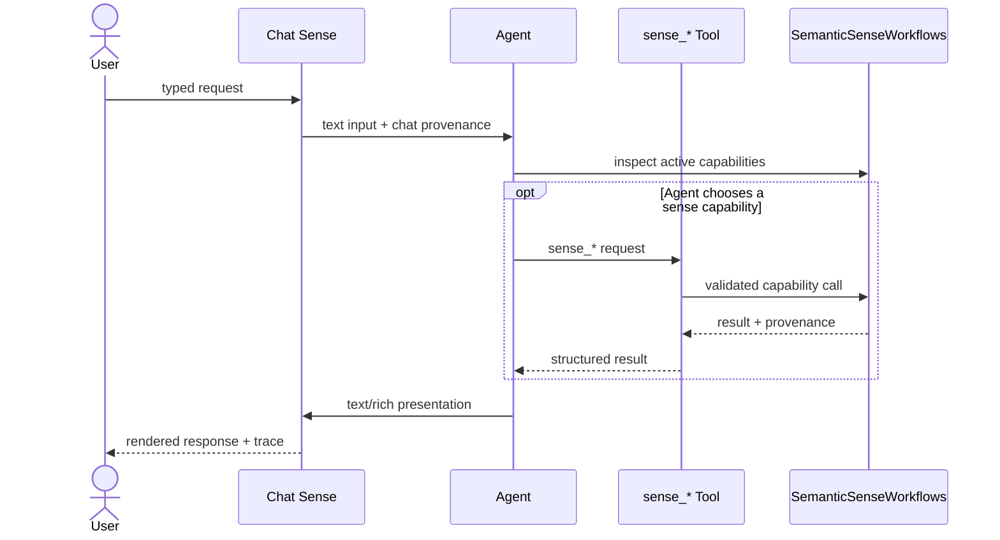
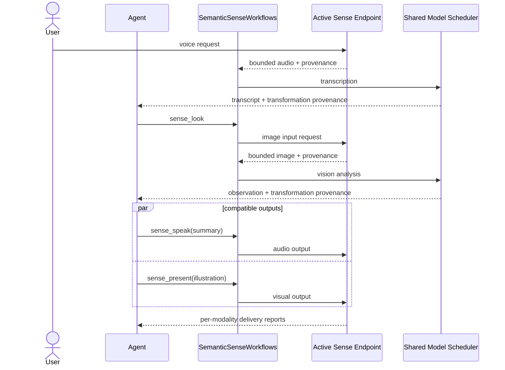
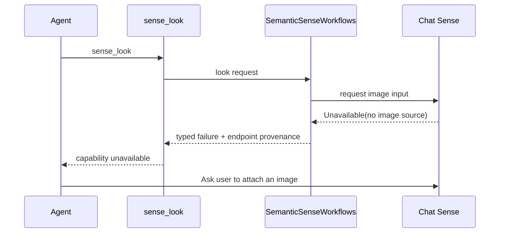

# Agent Senses Architecture

## Status

This document defines the target architecture for bidirectional, multimodal interaction between an agent and a user-facing sense endpoint. It also records current implementation gaps so that target behavior is not confused with behavior already present in the code.

This document describes the target architecture for the sense layer itself.
Implementation status and the product use-case roadmap are tracked by the
consuming application that embeds this library, not by this repository.

## Definition

A **sense endpoint** is a bidirectional collection of input and output capabilities through which an agent can perceive and affect a user-facing environment.

Inputs may include:

- typed text;
- microphone audio;
- camera images;
- uploaded images or files;
- tap, button, keyboard, and other interaction events;
- device or environment state when that state is genuinely available.

Outputs may include:

- text;
- synthesized or pre-recorded audio;
- visual presentations, images, or illustrations;
- updates to an existing presentation.

A sense is not merely a sensor and is not synonymous with a hardware device. A phone chat window, a physical Halo, a phone acting as Halo, and a deterministic simulator are different sense endpoints with different capability profiles. The same agent may listen, look, speak, present, or await input through any endpoint that truthfully advertises the corresponding capability.

The agent chooses capabilities and target endpoints according to the user request and the endpoints bound to its session. It may invoke one capability at a time or combine compatible capabilities and endpoints, such as listening through Halo, speaking through Halo, and presenting a richer trace in chat. Whether operations can execute concurrently is declared by the participating endpoints and enforced by orchestration; it is never inferred from a backend name.

## Goals

- Give the agent generic, typed `sense_*` tools rather than device-branded tools.
- Make chat a reduced-capability sense endpoint instead of a parallel, privileged route to the agent.
- Support physical Halo, phone-as-Halo, chat, and explicit simulation through the same core contracts.
- Make every observation and effect traceable to its backend, fixture, model transformation, and delivery result.
- Fail explicitly when a capability is unavailable; never substitute a plausible hardcoded value.
- Allow compatible input and output modalities to run independently or concurrently.
- Keep model enrichment and agent decisions above raw endpoint I/O.
- Keep Halo-specific transport, rendering, firmware support, and fast Halo simulation in the Halo engine library.
- Apply explicit byte, time, concurrency, permission, and retention limits at every boundary.
- Use one shared model engine and scheduler for text, vision, and audio enrichment.

## Non-goals

- Pretending every endpoint has the same capabilities.
- Reporting phone state as Halo state, or inventing battery/device data when it is unavailable.
- Silently changing endpoint because an operation failed.
- Selecting a simulator merely because the app is a debug build.
- Treating fixture output, Kotlin simulation, or Python-emulator success as physical-Halo validation.
- Shipping CPython, Lupa, or the official Python `halo-emulator` in the APK.
- Moving model inference, agent tools, product workflows, or semantic presentation policy into the Halo engine.
- Moving generic sense contracts into a Halo-specific library.

## Architectural decisions

### AD-1: Senses are bidirectional and multimodal

The core abstraction describes capabilities in both directions:

```text
user/environment ──► input capability ──► agent
user/environment ◄── output capability ◄── agent
```

A single interaction can use several modalities:

```text
voice request + camera observation
                │
                ▼
              agent
                │
                ▼
spoken summary + visual illustration
```

The contract must therefore represent modality, direction, limits, provenance, and resource conflicts. It must not assume that input means BLE capture or that output means a Halo display.

### AD-2: Chat is a sense endpoint

The Android chat window is not a separate agent architecture. It is a reduced-capability implementation of the same sense boundary.

A baseline chat endpoint can advertise:

| Direction | Capability | Backing UI |
|---|---|---|
| Input | text | text composer |
| Input | image | attachment picker, if enabled |
| Output | text | conversation timeline |
| Output | image/rich visual | chat card or attachment, if enabled |
| Input | interaction | approval, selection, or action controls |
| Output | audio | phone speaker, only if explicitly enabled |

It does not advertise camera capture, microphone capture, battery, tap, or wearable presentation unless those capabilities are actually connected. If phone microphone, camera, speaker, or battery are exposed, they belong to a phone endpoint/profile and are labeled as phone resources, not Halo resources.

This gives a concrete test of device neutrality: an agent workflow must continue with reduced modalities or report a typed unavailable capability instead of relying on Halo assumptions.

### AD-3: Agent tools are generic

The target agent surface uses generic names:

| Target tool | Meaning |
|---|---|
| `sense_capabilities` | Inspect session-bound endpoints, supported modalities, limits, and concurrency profiles. |
| `sense_listen` | Capture audio from a selected endpoint and return a semantic transcript with provenance. |
| `sense_look` | Obtain an image from a selected endpoint and return a semantic visual observation with provenance. |
| `sense_wait` | Await a supported user interaction from a selected endpoint. |
| `sense_speak` | Synthesize and deliver speech through a selected audio output. |
| `sense_present` | Deliver text, a visual presentation, an image, or structured content to a selected endpoint. |
| `sense_status` | Read only endpoint state that is genuinely exposed. |

Capability tools accept an endpoint identifier when more than one bound endpoint supports the request. If the target is omitted and selection would be ambiguous, orchestration returns the eligible endpoints instead of silently choosing one. A combined output request may ask orchestration to speak and present concurrently, including across different endpoints. Independent tool calls may also overlap when all participating endpoint profiles declare them compatible.

Current `halo_*` tools and `/v1/capabilities/halo/*` routes are implementation-era names, not the target contract. During migration they may remain as deprecated adapters that call `sense_*`; they must not contain separate behavior. The generic tool result includes the endpoint identity and provenance so the agent knows whether it used chat, phone, physical Halo, or an explicit simulator.

### AD-4: Capability absence is normal

An endpoint advertises what it can do. Unsupported features are not exceptional architecture failures and must not produce guessed values.

Examples:

- Chat asked for battery: return `Unavailable` with `endpoint=chat` and `capability=status.battery`.
- Chat asked to look without an attached image source: return `Unavailable`; do not use a fixture image.
- Physical Halo asked to render unsupported presentation content: return `Rejected` or `Unavailable`; do not silently render plain text unless the agent requests that fallback.
- Simulator asked for battery: return scenario data explicitly marked as a fixture.
- Phone asked for battery: it may return phone battery only if the active profile advertises it, with `origin=phone`; it must never be labeled Halo battery.

Fallback is an agent decision made after a structured failure. Infrastructure may not silently switch endpoint, fixture, model, or modality.

### AD-5: Provenance is part of every result

A result that cannot answer “where did this come from?” cannot be trusted in a diagnostic workbench.

Every input observation and output delivery report carries at least:

```text
operationId
endpointId
backendName
backendKind: physical | phone | chat | simulator
capability
origin: camera | microphone | keyboard | attachment | fixture | model | speaker | display
fixtureId, when applicable
media format and dimensions/duration, when applicable
transformations: normalization, ASR, vision model, TTS, HSD compilation
startedAt / completedAt
delivery status or typed failure
```

Hardcoded media or answers are allowed only inside explicit test fixtures. Their provenance must include `backendKind=simulator` and a stable `fixtureId`. Product code may not catch a failure and return fixture content.

A diagnostic workbench renders this chain alongside the human-readable result. Logs must contain identifiers and metadata, but not raw private media, prompts, credentials, or transcripts unless an explicit diagnostic export is requested.

### AD-6: Separate raw endpoint I/O from model enrichment

The endpoint-facing layer captures or emits bounded media, content, state, and events. It does not transcribe audio, analyze images, synthesize language, choose tools, or invent fallbacks.

The app-facing orchestration layer composes raw capabilities with model and platform adapters:

- audio input → normalization → model transcription;
- image input → normalization/downsampling → model vision observation;
- response text → Android TTS → normalized audio → endpoint playback;
- semantic result → endpoint-specific presentation mapping;
- structured visual result for Halo → HSD → HRP/Lua → Halo display.

A backend remains useful without a model, and model-enriched workflows remain testable against several backends.

### AD-7: One contract, explicit endpoint profiles

Application and agent code receive a registry of session-bound sense endpoints, not `HaloConnectionManager`, `BluetoothGatt`, Compose callbacks, or emulator objects. A session can bind one endpoint for a focused wearable interaction or several endpoints for coordinated multimodal behavior.

The current `SenseEndpoint` is the implemented starting point. The target contract must add text/image push input and text/rich output without weakening the bounded raw media methods. An illustrative profile is:

```kotlin
data class SenseProfile(
    val endpointId: String,
    val backendName: String,
    val backendKind: BackendKind,
    val capabilities: Set<SenseCapability>,
    val limits: Map<SenseCapability, SenseLimits>,
    val concurrency: ConcurrencyProfile,
)
```

The exact API can evolve, but these rules cannot:

- `core` contains no Android, BLE, model, Node, Ktor, Compose, Python, or firmware types.
- Media has explicit format metadata and enforced maximum sizes.
- Operations are cancellable and have deadlines.
- Every result has provenance.
- Errors map to stable typed categories.
- Capability support is discoverable before invocation and rechecked by the backend.
- Physical and simulated implementations pass the same applicable contract suite.

### AD-8: Concurrency is capability-based

“Multimodal” does not imply that all hardware can run all operations simultaneously. Each operation declares required logical resources, and the endpoint exposes compatible/conflicting combinations.

Examples:

- Chat text input and chat visual output may overlap.
- Phone camera capture and phone audio playback may overlap if platform policy allows it.
- Halo microphone and speaker conflict by default until full-duplex/AEC behavior is measured.
- Halo display updates may overlap audio operations if transport and firmware measurements prove safe.
- Model text, audio, and vision inference share a scheduler because they use one model engine and constrained memory, even when device I/O can overlap.

The coordinator serializes conflicts, permits declared independent operations, and cancels/replaces only operations sharing a replaceable resource. A combined `speak + present` response returns one delivery report per modality; partial success remains visible.

### AD-9: No build-type-selected behavior

`BuildConfig.DEBUG` may expose diagnostic screens and simulator choices, but it must not silently bind a simulator to an agent session.

Endpoint selection is explicit, visible, and recorded in provenance. Release wiring must not import fixture implementations. Tests may inject a simulator through dependency construction, not through product fallback logic.

### AD-10: Python remains a development oracle

The official Python `halo-emulator` executes device-side Lua and remains the fidelity oracle for its supported firmware surface. It is not an Android runtime dependency and does not validate physical BLE, camera, speaker acoustics, microphone quality, Android lifecycle, or device memory limits.

The APK has no Python dependency. A future out-of-process desktop bridge may be useful but cannot become a production fallback.

## Target dependency direction

```text
                          agent
                           │
                     generic sense_* tools
                           │
                  authenticated capability API
                           │
                   SemanticSenseWorkflows
              ┌────────────┼─────────────┐
              │            │             │
       model adapters   policies    presentation mapping
      ASR / vision /    limits      endpoint-aware
           TTS
              └────────────┼─────────────┘
                           │
                 SenseEndpointRegistry
         ┌─────────────────┼──────────────────┐
         │                 │                  │
      Chat sense       Phone sense        Halo sense
   Compose channels  Android media      HaloSenseEndpoint
                                              │
                                          halo-engine
                                  ┌───────────┴───────────┐
                                  │                       │
                            physical transport      Halo simulation
                            BLE + Lua runtime       HUD/protocol recorder

A generic deterministic SenseEndpoint simulator remains available for contract,
workflow, failure, and provenance tests that are not Halo-specific.
```

Dependencies flow downward:

- Agent tool adapters do not call BLE, Compose, or model APIs directly.
- Capability routes authenticate, validate, and delegate.
- Endpoint implementations do not call models or make agent decisions.
- Chat UI channels do not bypass the agent/session path for semantic answers.
- Simulator packages do not enter release dependency wiring.
- `halo-engine` does not know about agents, models, transcripts, or product workflows.

## Integrating an agent

The library is agent-runtime agnostic. A host wires an agent to the sense
boundary in five steps:

1. **Construct endpoints.** Instantiate the endpoints the host supports —
   `PhysicalHaloEndpoint` for a bonded Halo, `SimulatedHaloEndpoint` for
   tests and demos, or custom `SenseEndpoint` implementations for chat,
   phone, or other surfaces. Each advertises a truthful `SenseProfile`.

2. **Bind through the registry.** Register endpoints in an
   application-scoped `SenseEndpointRegistry`, then explicitly bind the
   endpoints for each agent session. Binding is user-visible; endpoints are
   never swapped silently mid-operation.

3. **Expose generic tools.** Map agent tool calls onto capability methods:
   `sense_listen` → `audioInput`, `sense_look` → `imageInput`,
   `sense_speak` → `audioOutput`, `sense_present` → `visualOutput`,
   `sense_wait` → `interactionInput`, `sense_status` → `statusInput`, and
   `sense_capabilities` → profile enumeration. When several bound endpoints
   support a capability and no target is specified, return the eligible set
   to the agent instead of choosing silently.

4. **Keep models above endpoints.** Endpoints return bounded raw media and
   typed state; enrichment (ASR, vision observation, TTS) lives in model
   adapters owned by the host or composed through `:orchestration`.
   `SemanticSenseWorkflows` already composes the common
   listen/look/speak/present paths with limits and concurrency policy, so a
   tool adapter can delegate rather than orchestrate by hand.

5. **Let the agent own fallback.** On a typed `SenseFailure`, return the
   structured failure — category, endpoint, capability — to the agent. The
   agent decides whether to retry, select another endpoint, degrade the
   modality, or ask the user. Infrastructure never substitutes an endpoint,
   fixture, or fabricated value.

For agents hosted behind an API, `:routes` exposes the same contract over
authenticated `/v1/sense/*` HTTP routes, so remote tool adapters stay thin.

## Endpoint profiles

### Chat

Purpose:

- canonical reduced-capability, directly observable sense;
- convenient typed requests and text/rich responses;
- optional user-selected image attachments;
- explicit approvals and controls.

It must use the same agent session and generic tools as other endpoints. A direct vision pre-pass that bypasses shared sense orchestration is a parallel semantic path and a migration gap: image input must route through the sense boundary like any other capability.

### Phone

Purpose:

- real microphone, camera, loudspeaker, and screen testing without glasses;
- phone-native interaction and permissions;
- optional phone-as-Halo profile for experience testing.

Phone-as-Halo captures from the phone camera, center-crops and normalizes to the selected Halo-compatible resolution, and renders Halo presentations within the actual circular optical zone. It identifies every origin as `phone`; it does not claim that phone acoustics, camera, display, or battery are Halo hardware.

### Physical Halo

Purpose:

- real wearable input/output and acceptance testing;
- BLE, firmware, camera, microphone, speaker, display, input, status, and constrained-memory behavior.

The Halo profile advertises only features validated against the connected firmware and negotiated runtime.

### Generic deterministic simulator

Purpose:

- contract and workflow tests independent of any device family;
- explicit fixtures, virtual time, cancellation, limits, concurrency, and typed failures;
- provenance tests proving that fixture data remains visible as fixture data.

It does not pretend to be a physical device and cannot be the implicit default in a host's interactive surface.

## `halo-engine` boundary

`halo-engine` is the Halo implementation support library. Its scope is broader than graphics but remains Halo-specific.

It owns:

- HSD validation and HSD → HRP/Lua compilation;
- Halo display geometry, optical-zone clipping, fonts, palettes, and safety profiles;
- protocol constants, framing, request/response, chunk streaming, and byte ceilings;
- `HaloSession`, Android BLE transport, GATT channel, and runtime installation;
- the stock-compatible device-side Lua runtime;
- firmware-facing camera, microphone, speaker, battery/status, and input protocol support;
- Kotlin/Python reference vectors and Python-emulator integration tests;
- a fast in-process Halo simulator/recorder for Android and JVM development;
- an Android HUD preview that renders the circular Halo display without starting the Python emulator;
- optional protocol simulation for ACKs, chunking, delays, disconnects, and recorded outputs.

It does not own:

- generic sense contracts;
- agent tool names or schemas;
- model inference, ASR, vision analysis, or TTS policy;
- chat behavior;
- product workflows or semantic presentation templates;
- silent fallback from physical Halo to simulation.

The fast Halo simulator belongs here because Halo geometry, HSD/HRP interpretation, Lua/runtime protocol behavior, and firmware profiles are Halo-domain knowledge. A generic `SimulatedSenseEndpoint` may wrap that simulator through `HaloSenseEndpoint`, while generic non-Halo fixture simulation can remain in `agent-senses:simulator`.

## Required end-to-end sequences

### Text request through the chat sense



### Voice request, visual observation, multimodal response



### Unsupported capability and agent-chosen fallback



The infrastructure does not substitute a fixture or another endpoint. The alternative behavior is visible as an agent decision.

## Host application surfaces

A consuming application should expose two related surfaces built on the same contracts.

### Sense experience

This is the user-observable agent interaction:

- bind one or more endpoints to the session explicitly;
- enter text, hold to talk, attach an image, or interact through a bound endpoint;
- run the real agent and generic `sense_*` tools;
- receive text, audio, and visual output through one or several endpoints;
- show every bound and targeted endpoint with concise provenance;
- for Halo simulation, render the true circular 256×256 optical zone rather than a larger black rectangle.

### Sense diagnostics

This exposes raw and composed operations:

- capability profile and concurrency matrix;
- raw capture/playback/presentation/input controls;
- fixture and fault selection;
- operation lifecycle and cancellation;
- exact provenance and transformation chain;
- output artifacts and typed failures.

Diagnostic success never appears identical to product success. Simulator and fixture results are visibly marked, and direct raw calls are labeled as bypassing the agent.

## Lifecycle and scheduling

- An application-scoped registry owns available endpoints; each agent session explicitly binds one or more of them.
- Binding, unbinding, and target changes are user-visible and do not occur during an operation unless requested.
- The endpoint owns connection and low-level resource lifecycle.
- `SemanticSenseWorkflows` owns composition, limits, concurrency policy, and model adapters.
- BLE writes remain serialized by the Halo transport.
- One resource conflict domain permits one active operation unless its profile declares safe multiplexing.
- Expensive model operations share one inference scheduler.
- Cancellation and timeout issue matching stop/clear behavior in `finally`.
- Application shutdown stops capture/playback, disconnects transports, closes TTS, then closes model and application runtime resources.

## Bounded data and retention

Every boundary enforces limits rather than trusting agent tool descriptions:

- text input and output characters/tokens;
- recording duration and PCM/container bytes;
- image dimensions and encoded/decoded bytes;
- speaker input length and playback duration;
- HSD, HRP, sprite, retained asset, and estimated working-set bytes;
- model media dimensions and bytes;
- tool-result and provenance size.

Media is ephemeral by default. Raw media is persisted only by explicit user action. Temporary TTS files are deleted in `finally`. Diagnostics do not persist private content, prompts, credentials, or raw media by default.

## Error contract

Backends map failures to stable categories:

- `Unavailable` — endpoint or capability not present;
- `Disconnected` — connection lost before completion;
- `Timeout` — deadline expired;
- `Cancelled` — caller replaced or cancelled the operation;
- `Rejected` — invalid request or unsupported configuration;
- `LimitExceeded` — byte, time, or hardware budget exceeded;
- `Protocol` — malformed message, endpoint error, or framing failure;
- `PermissionDenied` — platform permission or user consent missing;
- `ModelUnavailable` — semantic enrichment could not run;
- `Internal` — uncategorized failure.

Failures include endpoint and operation provenance. Generic tools return structured failures to the agent. Only the agent may select a reduced-modality response or ask the user for another input.

## Emulator and simulator strategy

No single simulator proves the system.

### Generic sense simulator

Validates contracts, workflows, timeouts, resource conflicts, capability absence, fixture provenance, and agent recovery without claiming a device family.

### In-process Halo simulator in `halo-engine`

Validates Halo-specific HSD/HRP rendering, the circular HUD preview, protocol framing, bounded chunks, runtime commands, event injection, and recorded speaker/display output. It is fast enough for interactive host surfaces and does not require Python. It is not firmware-faithful unless a behavior is explicitly covered by shared vectors or physical measurements.

### Official Python `halo-emulator`

Executes device-side Lua under Lua 5.4 and remains the development oracle for supported display/runtime behavior. Its current camera, microphone, speaker, BLE timing, memory, and Android-lifecycle limitations remain outside its proof boundary.

### Physical Halo

Required for BLE timing and reconnects, real camera format/latency, microphone quality/AEC, speaker acoustics and pacing, simultaneous operations, firmware memory/fragmentation, thermal behavior, battery, and endurance.

## Verification matrix

| Behavior | Unit/contracts | Generic simulator | Halo simulator | Python emulator | Phone | Physical Halo |
|---|---:|---:|---:|---:|---:|---:|
| Generic tool schema and auth | Yes | Yes | Optional | No | Yes | Yes |
| Capability absence and fallback visibility | Yes | Yes | Yes | No | Yes | Yes |
| Provenance chain | Yes | Yes | Yes | Optional | Yes | Yes |
| Chat text/rich interaction | Yes | Yes | No | No | Yes | No |
| Workflow cancellation and concurrency | Yes | Yes | Yes | Partial | Yes | Yes |
| HSD/HRP layout and limits | Yes | No | Yes | Yes | Preview | Yes |
| Circular Halo HUD rendering | Vectors | No | Yes | Yes | Preview | Visual |
| Device-side Lua execution | No | No | Optional | Yes | No | Yes |
| Camera semantic path | Fixture | Fixture | Fixture | No today | Yes | Yes |
| Real microphone/AEC quality | No | No | No | No | Phone only | Yes |
| Audible output | No | Recorded | Recorded/phone monitor | No | Yes | Yes |
| BLE MTU/ACK/reconnect | Fakes | No | Simulated | In-memory | Partial | Yes |
| Firmware memory/OOM | Budgets | No | Budgets | No | No | Yes |
| Thermal/battery endurance | No | No | No | No | Phone only | Yes |

## Current implementation versus target

Implemented today, in this repository:

- `SenseEndpoint` contracts, profiles, provenance, typed failures, endpoint registry, and resource-domain coordination in `core`;
- `PhysicalHaloEndpoint` in `halo` and the deterministic `SimulatedHaloEndpoint`, scripted scenarios, and fixtures in `simulator`;
- `SemanticSenseWorkflows` for transcription, vision observation, TTS, presentation, and listen/look multimodal workflows in `orchestration`;
- authenticated generic `/v1/sense/*` routes in `routes`;
- the shared `SenseEndpointContractTest` suite every endpoint must pass;
- the Halo-specific protocol and runtime boundary in the `halo-engine` composite build.

A consuming application provides the remaining pieces: the agent runtime and
generic `sense_*` tool adapters, any chat or phone endpoint implementations,
model adapters (ASR, vision, TTS), and the experience/diagnostic surfaces.

Remaining implementation gaps:

1. Text and image push input and rich output are target contract surface (AD-7) not yet exposed by every endpoint implementation.
2. Combined-output requests (speak plus present) should produce one typed combined result rather than two independent calls.
3. Explicit deterministic fault scenarios, interaction-event resumption, and agent-selected missing-capability fallback still need end-to-end coverage.
4. Physical-Halo listen/look/speak/present, camera, audio quality, BLE timing, reconnect, memory, thermal, and endurance behavior remain hardware-validation work.

The architecture document is a target and implementation map; completion status for individual items is tracked by the consuming application, while physical-device claims remain gated by documented hardware tests.

## Firmware and memory reality

Halo Lua uses a custom allocator backed by shared managed pools, not an isolated fixed-size heap. Available memory depends on firmware configuration, audio/AEC state, fragmentation, and workload.

Consequences:

- Do not claim that Lua has a fixed small heap based on a single observation.
- Treat engine limits as conservative policy, not measured free memory.
- Emulator host memory never justifies increasing hardware limits.
- Record firmware revision, operation, payload sizes, free bytes, allocation failures, and largest allocatable block where available before changing a profile.

## Change policy

A change to a sense modality or endpoint updates, as applicable:

1. core capability, limits, provenance, and error contracts;
2. generic tool and route schemas together;
3. chat and phone endpoint behavior;
4. physical Halo implementation;
5. generic simulator behavior and fixture identification;
6. `halo-engine` protocol, HUD simulator, runtime, and shared vectors;
7. Python-emulator tests for its supported surface;
8. host experience and diagnostic surfaces;
9. physical hardware acceptance checks for behavior simulation cannot prove.
